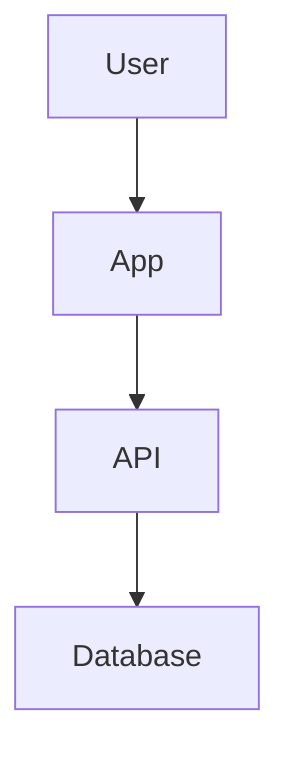

# Documentation style guide

## Core principles

- Lead with the reader’s goal.
- Explain the “why” before detailed steps.
- Use project-specific names, commands, paths, and conventions.
- Prefer concrete examples over abstract explanation.
- Write for scanning with headings, lists, tables, and examples.
- Avoid filler, hype, and unsupported claims.
- Mark uncertain or unverified details instead of presenting them as fact.

---

## Voice and tone

- Professional but approachable.
- Direct and practical.
- Use active voice.
- Address the reader as “you” when helpful.
- Use imperative mood for instructions: “Run”, “Open”, “Create”.
- Use inclusive, gender-neutral language.
- Keep paragraphs short.

---

## Markdown formatting

- Use GitHub Flavored Markdown.
- Use sentence case for headings.
- Use `backticks` for filenames, commands, variables, packages, options, and identifiers.
- Use **bold** for UI labels.
- Use numbered lists for ordered procedures.
- Use bullet lists for unordered concepts, requirements, or options.
- Use tables only when they make comparison or scanning easier.
- Do not add empty sections.

---

## Code blocks

Use fenced code blocks with a language identifier when possible.

```bash
npm install
npm run dev
`````

For terminal commands:

* Do not include shell prompts like `$`.
* Prefer copy-pasteable commands.
* Use placeholders that are obviously fake.
* Do not include real secrets, tokens, private keys, session cookies, or production credentials.

Example placeholder:

```bash
cp .env.example .env
API_URL="https://example.com"
```

---

## README.md structure

A practical `README.md` usually includes:

```text
# Project name

One-paragraph value proposition.

## Prerequisites
## Installation
## Configuration
## Usage
## Development
## Testing
## Troubleshooting
## Contributing
## License
```

Adapt sections to the project. Skip sections that do not apply.

---

## API documentation structure

For each endpoint, include relevant items from this list:

```text
Endpoint:
Method:
Authentication:
Path parameters:
Query parameters:
Request body:
Response body:
Success response:
Error responses:
Example request:
Example response:
```

Document known error responses, not only the happy path.

Example:

````markdown
### Create user

`POST /users`

Creates a user account.

#### Request body

```json
{
  "email": "user@example.com",
  "name": "Example User"
}
````

#### Response: `201 Created`

```json
{
  "id": "usr_123",
  "email": "user@example.com"
}
```

#### Errors

| Status | Reason               |
| -----: | -------------------- |
|  `400` | Invalid request body |
|  `409` | Email already exists |

````

---

## Tutorial structure

Use this structure for task-oriented guides:

```text
# Task-oriented title

Outcome-focused introduction.

## Prerequisites
## Before you start
## Step 1: ...
## Step 2: ...
## Verify the result
## Troubleshooting
## Next steps
````

---

## Architecture doc structure

Use this structure for architecture documentation:

```text
# Architecture overview

## Purpose
## System context
## Components
## Data flow
## Key decisions
## Tradeoffs
## Failure modes
## Security considerations
## Operational notes
```

---

## ADR structure

Use this structure for architecture decision records:

```text
# ADR: Decision title

## Status
## Context
## Decision
## Consequences
## Alternatives considered
```

---

## Runbook structure

Use this structure for operational procedures:

```text
# Runbook: Operation or incident

## Purpose
## Symptoms
## Impact
## Preconditions
## Procedure
## Rollback
## Verification
## Escalation
```

---

## Diagrams

Use Mermaid only when it clarifies relationships, flow, sequence, state, or architecture better than prose.

Good uses:

* Request flow.
* System architecture.
* Sequence diagrams.
* State transitions.
* Deployment topology.

Avoid diagrams that duplicate a simple list.

Use fenced Mermaid blocks:



Keep diagrams small enough to maintain.
